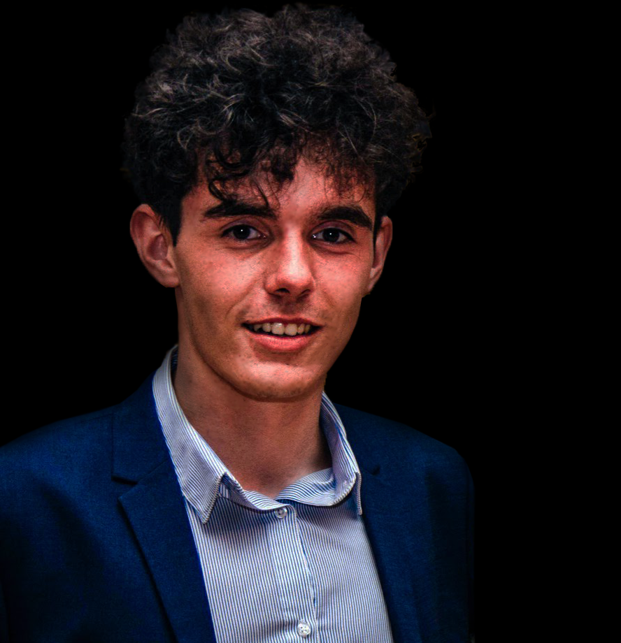

# Personal website - https://blasio99.github.io/
### &nbsp;&nbsp;&nbsp;&nbsp;&nbsp;&nbsp;&nbsp;&nbsp;&nbsp;&nbsp;&nbsp;&nbsp;&nbsp;&nbsp;&nbsp;&nbsp;&nbsp;&nbsp; by Benedek Balazs

  

  

  <h3 align="center">Benedek Balazs</h3>

## Table of Contents

* [About the Project](#about-the-project)
* [Contributing](#contributing)
* [Contact](#contact)

## About The Project
> *There is no Ctrl-Z in life.*  
  
\~ the creator: **Benedek Balázs**- the developer   

## Contact

Benedek Balazs - [LinkedIn profile](https://www.linkedin.com/in/benedek-balazs/) 

[Mail me](mailto:benedekbalazs1999@gmail.com) or use this mail address: <benedekbalazs1999@gmail.com>

Github Project Link: [Personal Website](https://github.com/blasio99/blasio99.github.io)
